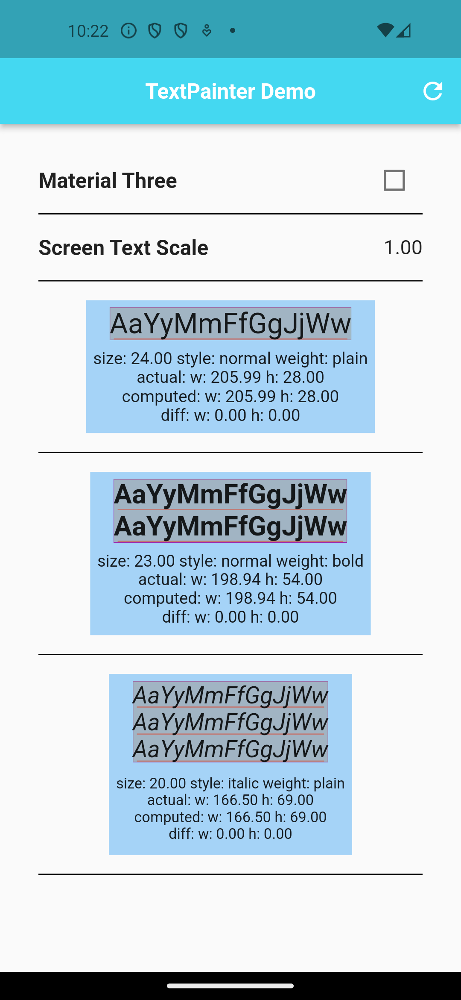
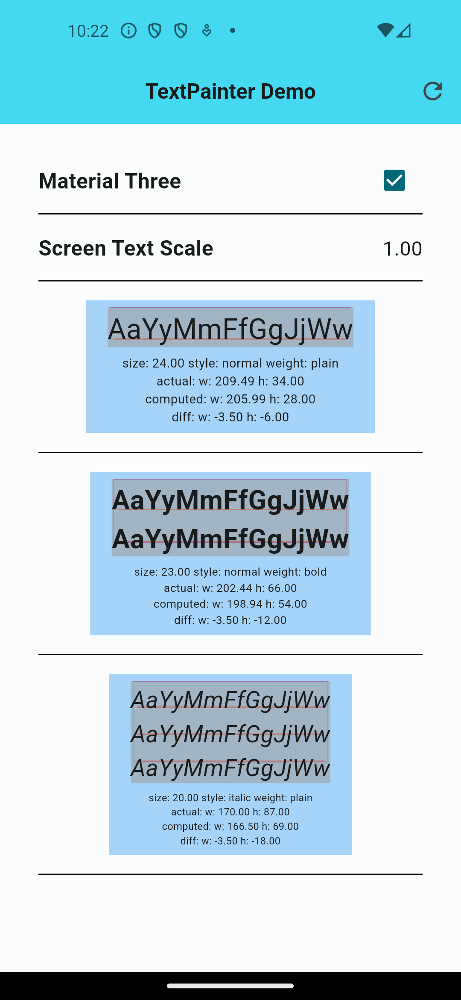

# TextPainter Demo
by allen brunson • january 2024

This demo app contains a lot of code. (Sorry about that.) It is all in service of demonstrating one relatively simple function, in this source file:

  `lib/text/text_painter.dart`
  
that has this signature:

  `TextPainter textPainterFromText(Text text)`  

As you might guess, this function creates a `TextPainter` object from the string data and properties it finds in the `Text` object it is passed as a parameter.

By default, if a `Text` object does not have its own `TextScaler`, then it makes itself larger or smaller depending on the current screen text scale, as set by the user in the iOS or Android settings. So for that reason, if `textPainterFromText()` discovers that the `Text` object it is given does not have its own `TextScaler`, then it uses the one that is currently in effect for the device.

The reason I wrote this function is so that I can determine exactly how big a `Text` object will be, once it is added to a widget tree. It worked perfectly for that task, for several years. I wrote a whole lot of code under the assumption that it would continue to work in the same way that it always has.

Then came Flutter version 3.16.0, material three became the default, and all hell broke loose. (At least for me, anyway.) If your Flutter app installs a `ThemeData` object that has `useMaterial3` set to true, then calculating the size of `Text` objects, using the `TextPainter` creation function I wrote, no longer works. The size values it returns are way off.

All the code I wrote in this demo app is to demonstrate this change in behavior, between the older material two style and the newer material three style.

In case you don’t want to bother running it, here is what the demo app looks like, when you start it up:

The demo app creates three sample `Text` objects, uses `textPainterFromText()` to create matching `TextPainter` objects, and then reports the results. The final rendered size of the `Text` object is reported as “actual,” and the size reported by the TextPainter object is shown as “computed.” Note that the reported sizes are absolutely dead-on, down to partial pixels.

Extra credit: if you use the Android or iOS settings app to change the text scale, that should be reported onscreen, after pressing the refresh button. The sizes of the `Text` objects will change, but the sizes reported by `TextPainter` are still dead-on, down to the sub-pixel.

Now, on to the problem. If you press the demo app’s check box, it switches into material three mode, and performs its `TextPainter` calculations again. Now it looks like this:

At this point, you can see that a `TextPainter` created from a `Text` no longer reports the same sizes that the `Text` object itself has.

At best, I am going to call this a design decision that I disagree with. At worst, I would call it a bug.

In the best case, I would hope that the Flutter maintainers would reverse this change, and make the behavior of `Text` and `TextPainter` objects match each other again. But if that is not going to happen, can you at least give me some workaround? Like, is there something I can do in the way I create either `TextPainter` or `Text` objects that would make them equivalent again?
